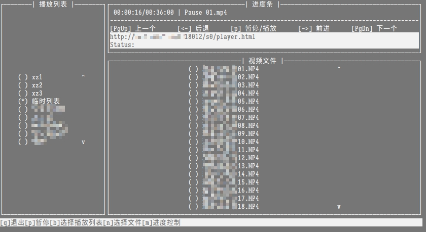
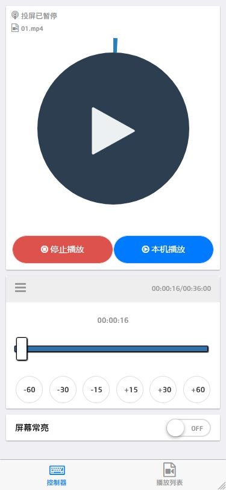
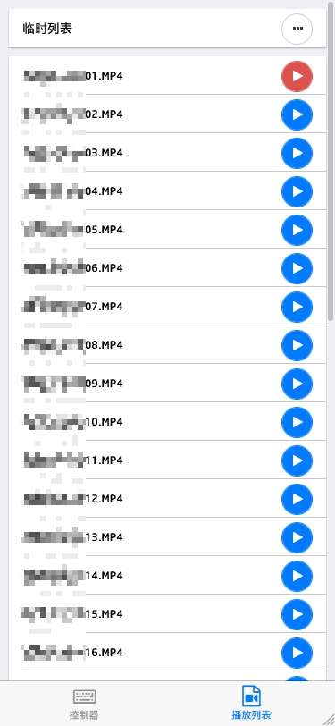

pysimpledlna
=====

介绍
------
一个dlna投屏工具

说明
------
:hammer_and_wrench: [编译](docs/compile.md)

:books: [使用说明](docs/usage.md)

:toolbox: [作为依赖库安装](docs/install.md)

:gear: [使用api](docs/api.md)

计划完成的功能
------
- [x] 播放列表
  - [x] 创建
  - [x] 删除
  - [x] 播放
- [x] 播放列表播放器
  - [x] 播放列表播放器切换播放列表中的视频
  - [x] 播放列表播放器暂停、停止、前进以及后退等常用功能
- [x] 手机控制
  - [x] 实现web ui
  - [ ] ~~手机扫码连接~~
- [ ] 对网络视频进行投屏
  
参考项目
------
1. <https://pypi.org/project/dlna/>
2. <https://pypi.org/project/nanodlna/>
3. <https://github.com/cherezov/dlnap>