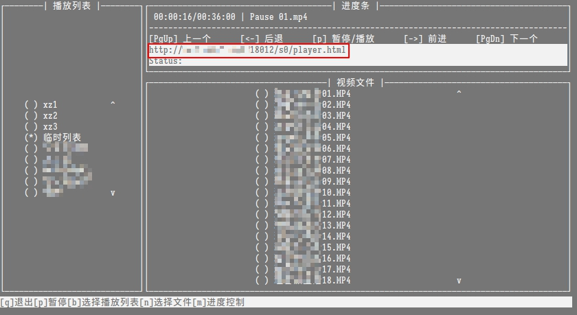

# 使用说明

## 命令行使用

所有的命令都支持`-h`查看详细帮助详细
1. 查找DLNA设备
    ```bash
    pysimpledlna list
    [ 1 ] Kodi (DESKTOP-O7IVEPH) @ http://192.168.199.151:1901/
    ```
    ```
    参数说明:
    -t  超时时间，在指定的时间内无法找到一台设备则返回
    -m  寻找设备数量最大值，达到最大值则返回，否则使用根据-t参数返回，默认值99999
    -dn 启用后不接收ssdp notify （部分设备会找不到）
    ```

2. 播放视频
    ```bash
    pysimpledlna play -i test.mkv -u http://192.168.199.151:1901/
    ```
    ```
    参数说明:
    -i 视频文件，支持多个文件，用空格分隔
    -u DLNA播放设备地址
    -a 自动选择第一台DLNA播放设备进行播放
    ```
3. 播放列表
大多数dlna设备不支持播放列表功能，自己实现播放列表。提供播放列表创建、删除、查看、播放以及更新功能。
    - 创建播放列表<br/>
    ```bash
    pysimpledlna playlist create -n test -i video_dir -f *.mp4 -sh 60 -st 120
    ```
    ```
    参数说明:
    -n  播放列表名称
    -i  包含视频文件的目录
    -f  过滤器支持通配符
    -sh 播放列表文件播放时跳过片头时长
    -st 播放列表文件播放时跳过片尾时长
    ```
    - 删除播放列表<br/>
    ```bash
    pysimpledlna playlist delete -n test
    ```
    - 查看播放列表<br/>
    ```bash
    pysimpledlna playlist view -n test
    ```
    - 列出所有播放列表<br/>
    ```bash
    pysimpledlna playlist list -n test
    ```
    - 刷新播放列表<br/>
    当目录文件有变动时使用
    ```bash
    pysimpledlna playlist refresh -n test
    ```
    - 更新播放列表<br/>
    ```bash
    pysimpledlna playlist update -n test -vi 1 -vp 200 -sh 30 -st 100
    ```
    ```
    参数说明:
    -vi 当前播放视频序号，从0开始
    -vp 当前视频播放进度，单位：秒
    -sh 播放列表文件播放时跳过片头时长
    -st 播放列表文件播放时跳过片尾时长
    ```
    - 播放<br/>
    ```bash
    pysimpledlna playlist play -n test -u http://192.168.1.3:8732/description.xml
    ```
    ```
    参数说明:
    -n 播放列表名字
    -u DLNA播放设备地址
    -a 自动选择第一台DLNA播放设备进行播放
    ```
4. 设置默认值
    使用播放功能时如果设置了默认播放器地址，可以不提供`-u`参数，使用默认的播放器进行播放
    ```bash
    pysimpledlna config -u http://192.168.199.151:1901/ -es True
    ```
    ```
    参数说明:
    -u    默认播放器地址，配置后使用播放功能可以不指定播放设备
    -es   是否启用SSL（true, false），乐播投屏支持，kodi不支持自认证或与域名不匹配的证书
    -cert 公钥，启用SSL后必须配置
    -key  私钥，启用SSL后必须配置
    -p    显示配置文件内容
    ```

### 交互模式
打开命令行窗口，直接输入`pysimpledlna`进入交互模式。交互模式下，播放视频功能将会启动新进程进行播放。


## 手机访问
在手机浏览器上输入命令行界面显示的地址


进入web界面


### 手机端本机播放
点击 `本机播放` ，视频会在手机端播放，投屏自动暂停。手机端播放进度不会自动同步到投屏处。点击 `返回投屏` 时播放进度会进行同步并保存。


## 启用SSL
DLNA规范文件中没有提到SSL，部分DLNA播放器不支持这个功能。Kodi不支持自签名的证书以及域名与证书不匹配的情况。乐播投屏支持SSL。

1. 安装openssl
2. 创建证书，OPENSSL_CONF需要设置为自己的路径
```bash
set OPENSSL_CONF=you_path\openssl.cnf
openssl  genrsa -des3 -out server.key 4096
openssl req -new -key server.key -out server.csr
copy server.key  server.key.ori
openssl rsa -in server.key.ori  -out server.key  #去除私钥密码
openssl x509 -req -days 3650 -in server.csr -signkey server.key -out server.crt #自签名公钥
```
3. 启用ssl支持
<br/>参考 `使用说明` -> `设置默认值`

## ~~Windows右键支持~~

1. ~~安装右键菜单~~
```
pysimpledlnaW install
```

2. ~~删除右键菜单~~
```
pysimpledlnaW uninstall
```
3. ~~播放视频~~
```
在包含mp4, mkv文件的目录上右键 -> DLNA Share，程序自动选择第一台DLNA设备播放目录中的视频
```

